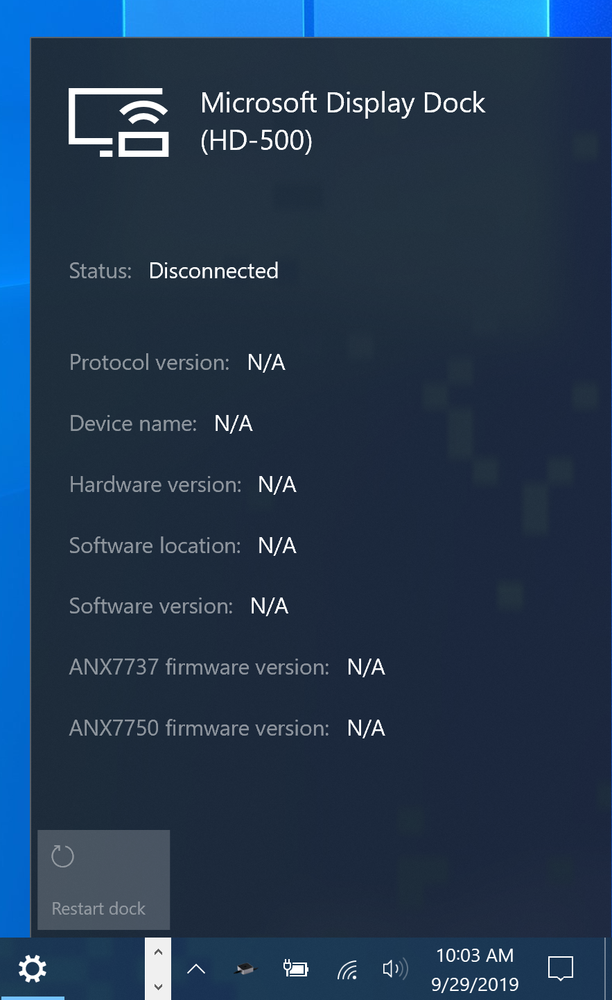

 # Microsoft Display Dock Taskbar Flyout
 
 This utility provides information about a connected Microsoft Display Dock on the system
 as well as:
 
 - Rebooting capability
 - Notifications when the device is connected or disconnected

 ## Screenshot

 

 

 

 

 # Acknowledgements

 [File-New-Project/EarTrumpet](https://github.com/File-New-Project/EarTrumpet) for the WindowsTaskbar class.
